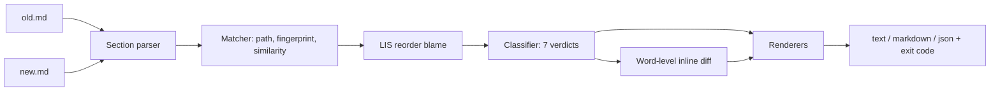

# prosediff

[English](README.md) | [中文](README.zh.md) | [日本語](README.ja.md)

[](LICENSE) [](CHANGELOG.md) [](pyproject.toml)  [](CONTRIBUTING.md)

**Markdown のルール／プロンプトファイル向けオープンソースのセクション認識 diff —— 削除＋追加のノイズではなく、移動・改名・書き直しを見せる。**


```bash
git clone https://github.com/JaydenCJ/prosediff && cd prosediff && pip install -e .
```

> **プレリリース：** prosediff はまだ PyPI に公開されていません。初回リリースまでは [JaydenCJ/prosediff](https://github.com/JaydenCJ/prosediff) をクローンし、リポジトリのルートで `pip install -e .` を実行してください。ランタイム依存はゼロ —— 標準ライブラリだけで動きます。

## なぜ prosediff？

ルールファイルは生きた文書です。CLAUDE.md、AGENTS.md、システムプロンプト、`.cursorrules` は絶えず再編成されます —— あるセクションが先頭に昇格し、見出しが改名され、段落は移動しながら引き締められる。行 diff はその用途に不向きです。`diff -u` は移動したセクションを「こちらで 20 行削除、あちらで 20 行追加」として描画し、その中で本当に変わった 1 語は見えません。レビュアーは移動を目で復元するのに何分も費やすか、流し読みして承認するか —— 静かに消された安全ルールはそうやって本番に出ます。prosediff は代わりに*文書構造*を diff します。両ファイルを見出しツリーに解析し、パス・内容フィンガープリント・文章類似度で 2 バージョンのセクションを対応付け、人が本当に知りたいことを報告します —— このセクションは移動した、あれは改名された、これは書き直された、*そして内部の単語レベルの変更はこれだ*、と。

|  | prosediff | `diff -u` | `git diff --color-moved` | pandiff | difftastic |
|---|---|---|---|---|---|
| 見出し構造を理解 | はい —— セクションツリー | いいえ | いいえ | いいえ（レンダリング後の文） | Markdown 文には無効 |
| 移動したセクションの検出 | はい、`moved` 1 件の判定として | いいえ | 移動した*行*の着色のみ | いいえ | いいえ |
| 改名／書き直しセクションの対応付け | はい、フィンガープリント＋類似度 | いいえ | いいえ | いいえ | いいえ |
| 変更セクション内の単語レベル diff | はい | いいえ | ファイル全体のみ | はい | はい |
| 機械可読レポート＋CI 終了コード | JSON（版付き schema）、終了コード 0/1/2 | 終了コードのみ | いいえ | いいえ | いいえ |
| ランタイム依存 | 0 | n/a（システム） | n/a（git） | pandoc + Node | Rust バイナリ |

<sub>prosediff の依存数は [pyproject.toml](pyproject.toml) の `dependencies = []` の通り。すべて Python ≥3.9 の標準ライブラリで動きます。</sub>

## 特長

- **編集に耐える移動検出** —— セクションを見出しパス、次に空白無視の内容フィンガープリント、最後にトークン類似度で対応付けるため、移動して*かつ*書き直されたセクションも `rewritten` 1 件の判定になり、削除＋追加にはなりません。
- **並べ替えは最小限に帰責** —— 最長増加部分列の 1 パスが、実際に文書順を壊したセクションだけに印を付けます。10 セクションのファイルで 1 つを上に動かせば、責められるのは 1 つだけです。
- **改名認識、コンテナも対象** —— 本文を持たない親見出しはサブツリーでフィンガープリントされるため、`## Ops` → `## Operations` の改名は 1 件の改名であり、全子セクションの書き直しにはなりません。
- **効く場所にだけ単語レベル diff** —— 変更セクションは `{-旧-}` / `{+新+}` の単語マーカーで表示され、空白の揺れは畳まれます。`make test` → `make check` はハイライトされた 1 語です。
- **Markdown を正しく解析** —— ATX と setext の見出し、コードフェンス内の `#` は無視、YAML front matter と前文は独立セクションとして追跡、重複見出しは自動で曖昧性解消。
- **レビューパイプラインのための設計** —— GNU diff 式終了コード（0 同一 / 1 差分あり / 2 エラー）、版付き JSON schema、PR コメント向け Markdown モード、そして `-` の stdin オペランドで `git show HEAD:CLAUDE.md | prosediff diff - CLAUDE.md` がそのまま動きます。

## クイックスタート

インストール：

```bash
git clone https://github.com/JaydenCJ/prosediff && cd prosediff && pip install -e .
```

同梱のサンプルペアを diff —— 1 回の編集で移動・改名・書き直し・編集・追加・削除が全部起きています：

```bash
prosediff diff examples/rules-old.md examples/rules-new.md
```

出力（実際の実行から転載）：

```text
prosediff: examples/rules-old.md -> examples/rules-new.md | 7 sections: 1 added, 1 removed, 1 rewritten, 1 edited, 1 renamed, 1 moved (1 unchanged)

> moved     ## Deploy checklist  (#5 -> #2)
~ edited    ## Build commands  (96% similar)
    Run `make build` to compile and `make {-test`-}{+check`+} before every commit.
    Never push with a red test suite.
^ renamed   ## Testing -> ## QA rules  (reordered)
! rewritten ## Code style -> ## Style guide  (87% similar)
    Four-space indentation, no tabs. Public functions need {-docstrings.-}{+docstrings+}
    {+and type hints. +}Keep modules under 400 lines; split by {-concern, not by layer.-}{+concern.+}
+ added     ## Security
    | Never commit secrets. Credentials come from the environment, and
    | example configs use `127.0.0.1` or `example.test` hosts only.
- removed   ## Legacy notes
    | The old importer was removed in v2. Do not resurrect it; the
    | replacement lives in `importer2/`.
```

同じペアを `diff -u` に通すと 40 行超の削除と追加です。スクリプトや CI ゲートには JSON を（schema は [`docs/diff-format.md`](docs/diff-format.md) に記載）：

```bash
prosediff diff examples/rules-old.md examples/rules-new.md --format json | python3 -c \
  "import json,sys; r=json.load(sys.stdin); print(r['changed'], r['counts']['removed'])"
```

```text
True 1
```

difftool の設定なしで、git から直接ワーキングツリーを HEAD と突き合わせてレビュー：

```bash
git show HEAD:CLAUDE.md | prosediff diff - CLAUDE.md
```

## 変更種別

| 判定 | 記号 | 意味 |
|---|---|---|
| `unchanged` | `=` | パス・本文・相対順序が同じ（`--all` 指定時のみ表示） |
| `edited` | `~` | パスと位置は同じで本文が変更 —— 単語 diff を表示 |
| `moved` | `>` | 本文は同一；親が変わったか文書順が壊れた |
| `renamed` | `^` | 本文は同一；見出しタイトルが変わった |
| `rewritten` | `!` | 本文が変わり、*かつ*そのセクションが移動または改名もされた |
| `added` | `+` | 旧文書に対応セクションがない |
| `removed` | `-` | 新文書に対応セクションがない |

## CLI リファレンス

| オプション | 既定値 | 効果 |
|---|---|---|
| `--format text\|markdown\|json` | `text` | 端末レポート、PR コメント用 Markdown、または版付き JSON |
| `--threshold 0..1` | `0.5` | 「移動かつ書き直し」セクションを対応付ける最低本文類似度 |
| `--all` | オフ | 未変更のセクションも列挙する |
| `--no-inline` | オフ | 変更セクション内の単語レベル diff を省く |
| `--color auto\|always\|never` | `auto` | ANSI 色（auto = stdout が TTY のときのみ） |

`prosediff outline FILE [--format text|json]` は 1 ファイルのセクションツリーを行範囲付きで表示します。`diff` の終了コード：`0` 同一、`1` 差分あり、`2` 使い方の誤りまたは読めない入力。

## 検証

このリポジトリは CI を持ちません。上記の主張はすべてローカル実行で検証されています。このリポジトリのチェックアウトから再現できます：

```bash
pip install -e '.[dev]' && pytest && bash scripts/smoke.sh
```

出力（実際の実行から転載、`...` は省略）：

```text
90 passed in 0.56s
...
[json] schema 1 report validated
SMOKE OK
```

## アーキテクチャ



## ロードマップ

- [x] セクションパーサ、3 パスマッチャ、LIS 並べ替え帰責、7 種の判定、単語レベルのインライン diff、text/Markdown/JSON 出力、outline コマンド（v0.1.0）
- [ ] PyPI 公開（`pip install prosediff`）
- [ ] `git difftool` と pre-commit フックのレシピをリポジトリに同梱
- [ ] 類似度行列の最適割当によるしきい値不要のマッチング
- [ ] 本文だけでなく、セクション内のリスト項目と表への判定

全リストは [open issues](https://github.com/JaydenCJ/prosediff/issues) を参照。

## コントリビュート

コントリビューション歓迎 —— [good first issue](https://github.com/JaydenCJ/prosediff/issues?q=is%3Aissue+is%3Aopen+label%3A%22good+first+issue%22) から始めるか、[discussion](https://github.com/JaydenCJ/prosediff/discussions) を開いてください。開発環境の構築は [CONTRIBUTING.md](CONTRIBUTING.md) を参照。

## ライセンス

[MIT](LICENSE)
