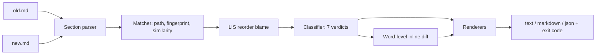

# prosediff

[English](README.md) | [中文](README.zh.md) | [日本語](README.ja.md)

[](LICENSE) [](CHANGELOG.md) [](pyproject.toml)  [](CONTRIBUTING.md)

**Open-source section-aware diff for Markdown rule and prompt files — see moves, renames, and rewrites instead of delete-plus-add noise.**


```bash
git clone https://github.com/JaydenCJ/prosediff && cd prosediff && pip install -e .
```

> **Pre-release:** prosediff is not yet published to PyPI. Until the first release, clone [JaydenCJ/prosediff](https://github.com/JaydenCJ/prosediff) and run `pip install -e .` from the repository root. Zero runtime dependencies — the standard library is all it needs.

## Why prosediff?

Rule files are living documents: CLAUDE.md, AGENTS.md, system prompts, and `.cursorrules` get reorganized constantly — a section promoted to the top, a heading renamed, a paragraph tightened while it moves. Line diffs are the wrong instrument for that: `diff -u` renders a moved section as twenty deleted lines here and twenty added lines there, and the one word that actually changed inside it is invisible. Reviewers either burn minutes reconstructing the move by eye or skim and approve — which is how a quietly deleted safety rule ships. prosediff diffs the *document structure* instead: it parses both files into heading trees, pairs sections across the two versions by path, by content fingerprint, and by prose similarity, and then reports what a human actually wants to know — this section moved, that one was renamed, this one was rewritten *and here is the word-level change inside it*.

|  | prosediff | `diff -u` | `git diff --color-moved` | pandiff | difftastic |
|---|---|---|---|---|---|
| Understands heading structure | Yes — section tree | No | No | No (rendered prose) | No for Markdown prose |
| Detects moved sections | Yes, as one `moved` verdict | No | Paints moved *lines* only | No | No |
| Pairs renamed / rewritten sections | Yes, fingerprint + similarity | No | No | No | No |
| Word-level diff inside a changed section | Yes | No | Whole file only | Yes | Yes |
| Machine-readable report + CI exit code | JSON (versioned schema), exit 0/1/2 | Exit codes only | No | No | No |
| Runtime dependencies | 0 | n/a (system) | n/a (git) | pandoc + Node | Rust binary |

<sub>prosediff's dependency count is `dependencies = []` in [pyproject.toml](pyproject.toml); everything runs on the Python ≥3.9 standard library.</sub>

## Features

- **Move detection that survives edits** — sections are paired by heading path, then by whitespace-insensitive content fingerprint, then by token similarity, so even a section that moved *and* was rewritten is one `rewritten` verdict, not delete-plus-add.
- **Minimal blame for reorders** — a longest-increasing-subsequence pass flags only the sections that actually broke document order: moving one section up a ten-section file blames one section, not ten.
- **Rename-aware, including containers** — a parent heading with no prose of its own is fingerprinted by its subtree, so renaming `## Ops` to `## Operations` is one rename, not a rewrite of every child.
- **Word-level diffs where it matters** — changed sections show `{-old-}` / `{+new+}` word markers with whitespace churn folded away, so `make test` → `make check` is one highlighted word.
- **Markdown parsed properly** — ATX and setext headings, `#` inside code fences ignored, YAML front matter and preamble tracked as their own sections, duplicate headings disambiguated.
- **Built for review pipelines** — GNU-diff exit codes (0 identical / 1 differences / 2 error), a versioned JSON schema, a Markdown mode shaped for PR comments, and `-` stdin operands so `git show HEAD:CLAUDE.md | prosediff diff - CLAUDE.md` just works.

## Quickstart

Install:

```bash
git clone https://github.com/JaydenCJ/prosediff && cd prosediff && pip install -e .
```

Diff the shipped example pair — one edit session that moved, renamed, rewrote, edited, added, and removed sections:

```bash
prosediff diff examples/rules-old.md examples/rules-new.md
```

Output (copied from a real run):

```text
prosediff: examples/rules-old.md -> examples/rules-new.md | 7 sections: 1 added, 1 removed, 1 rewritten, 1 edited, 1 renamed, 1 moved (1 unchanged)

> moved     ## Deploy checklist  (#5 -> #2)
~ edited    ## Build commands  (96% similar)
    Run `make build` to compile and `make {-test`-}{+check`+} before every commit.
    Never push with a red test suite.
^ renamed   ## Testing -> ## QA rules  (reordered)
! rewritten ## Code style -> ## Style guide  (87% similar)
    Four-space indentation, no tabs. Public functions need {-docstrings.-}{+docstrings+}
    {+and type hints. +}Keep modules under 400 lines; split by {-concern, not by layer.-}{+concern.+}
+ added     ## Security
    | Never commit secrets. Credentials come from the environment, and
    | example configs use `127.0.0.1` or `example.test` hosts only.
- removed   ## Legacy notes
    | The old importer was removed in v2. Do not resurrect it; the
    | replacement lives in `importer2/`.
```

The same pair through `diff -u` is 40+ lines of deletes and adds. For scripts and CI gates, ask for JSON (schema documented in [`docs/diff-format.md`](docs/diff-format.md)):

```bash
prosediff diff examples/rules-old.md examples/rules-new.md --format json | python3 -c \
  "import json,sys; r=json.load(sys.stdin); print(r['changed'], r['counts']['removed'])"
```

```text
True 1
```

Review the working tree against HEAD with no difftool setup, straight from git:

```bash
git show HEAD:CLAUDE.md | prosediff diff - CLAUDE.md
```

## Change kinds

| Verdict | Glyph | Meaning |
|---|---|---|
| `unchanged` | `=` | Same path, same prose, same relative order (hidden unless `--all`) |
| `edited` | `~` | Same path and place, prose changed — word diff shown |
| `moved` | `>` | Prose identical; parent changed or document order broke |
| `renamed` | `^` | Prose identical; heading title changed |
| `rewritten` | `!` | Prose changed *and* the section also moved or was renamed |
| `added` | `+` | No counterpart in the old document |
| `removed` | `-` | No counterpart in the new document |

## CLI reference

| Option | Default | Effect |
|---|---|---|
| `--format text\|markdown\|json` | `text` | Terminal report, PR-comment Markdown, or versioned JSON |
| `--threshold 0..1` | `0.5` | Minimum prose similarity to pair a moved-and-rewritten section |
| `--all` | off | Also list unchanged sections |
| `--no-inline` | off | Skip word-level diffs inside changed sections |
| `--color auto\|always\|never` | `auto` | ANSI colors (auto = only when stdout is a TTY) |

`prosediff outline FILE [--format text|json]` prints one file's section tree with line spans. Exit codes for `diff`: `0` identical, `1` differences found, `2` bad usage or unreadable input.

## Verification

This repository ships no CI; every claim above is verified by local runs. Reproduce them from a checkout of this repository:

```bash
pip install -e '.[dev]' && pytest && bash scripts/smoke.sh
```

Output (copied from a real run, truncated with `...`):

```text
90 passed in 0.56s
...
[json] schema 1 report validated
SMOKE OK
```

## Architecture



## Roadmap

- [x] Section parser, three-pass matcher, LIS reorder blame, seven verdicts, word-level inline diff, text/Markdown/JSON output, outline command (v0.1.0)
- [ ] PyPI release with `pip install prosediff`
- [ ] `git difftool` and pre-commit hook recipes in-repo
- [ ] Threshold-free matching via optimal assignment on the similarity matrix
- [ ] Verdicts for list items and tables inside a section, not just prose

See the [open issues](https://github.com/JaydenCJ/prosediff/issues) for the full list.

## Contributing

Contributions are welcome — start with a [good first issue](https://github.com/JaydenCJ/prosediff/issues?q=is%3Aissue+is%3Aopen+label%3A%22good+first+issue%22) or open a [discussion](https://github.com/JaydenCJ/prosediff/discussions). See [CONTRIBUTING.md](CONTRIBUTING.md) for the development setup.

## License

[MIT](LICENSE)
