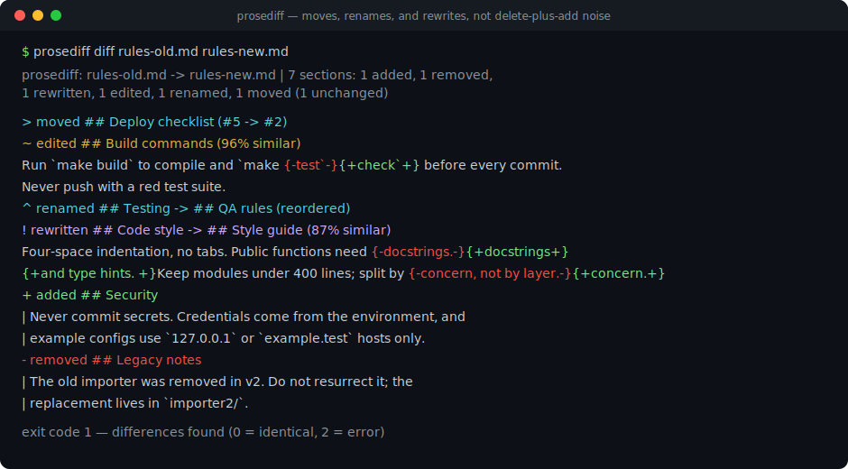
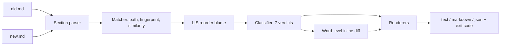

# prosediff

[English](README.md) | [中文](README.zh.md) | [日本語](README.ja.md)

[](LICENSE) [](CHANGELOG.md) [](pyproject.toml)  [](CONTRIBUTING.md)

**面向 Markdown 规则与提示词文件的开源结构感知 diff —— 呈现移动、改名与重写，而不是删除加新增的噪声。**



```bash
git clone https://github.com/JaydenCJ/prosediff && cd prosediff && pip install -e .
```

> **预发布：** prosediff 尚未发布到 PyPI。在首个正式版之前，请克隆 [JaydenCJ/prosediff](https://github.com/JaydenCJ/prosediff) 并在仓库根目录执行 `pip install -e .`。零运行时依赖 —— 只需要标准库。

## 为什么选 prosediff？

规则文件是活文档：CLAUDE.md、AGENTS.md、系统提示词和 `.cursorrules` 一直在被重组 —— 某节被提到最上面、某个标题被改名、某段在挪动的同时被精简。行级 diff 完全不适合这种场景：`diff -u` 会把一个被移动的小节渲染成这里删二十行、那里加二十行，而其中真正被改掉的那一个词根本看不见。审阅者要么花好几分钟靠肉眼还原这次移动，要么草草扫过直接批准 —— 一条被悄悄删掉的安全规则就是这样上线的。prosediff 改为对*文档结构*做 diff：把两个文件解析成标题树，按路径、按内容指纹、按行文相似度把两个版本的小节配对，然后报告人真正想知道的东西 —— 这一节移动了、那一节被改名了、这一节被重写了*并且给出内部的词级改动*。

|  | prosediff | `diff -u` | `git diff --color-moved` | pandiff | difftastic |
|---|---|---|---|---|---|
| 理解标题结构 | 是 —— 小节树 | 否 | 否 | 否（渲染后的文本） | 对 Markdown 文本为否 |
| 检测被移动的小节 | 是，输出一条 `moved` 结论 | 否 | 只给移动的*行*上色 | 否 | 否 |
| 配对被改名 / 被重写的小节 | 是，指纹 + 相似度 | 否 | 否 | 否 | 否 |
| 变更小节内部的词级 diff | 是 | 否 | 只能整文件 | 是 | 是 |
| 机器可读报告 + CI 退出码 | JSON（带版本 schema），退出码 0/1/2 | 仅退出码 | 否 | 否 | 否 |
| 运行时依赖 | 0 | n/a（系统） | n/a（git） | pandoc + Node | Rust 二进制 |

<sub>prosediff 的依赖数即 [pyproject.toml](pyproject.toml) 中的 `dependencies = []`；一切都跑在 Python ≥3.9 标准库上。</sub>

## 特性

- **经得起编辑的移动检测** —— 小节先按标题路径、再按忽略空白的内容指纹、最后按词元相似度配对，因此一个既移动*又*被重写的小节也是一条 `rewritten` 结论，而不是删除加新增。
- **重排只怪最少的小节** —— 一趟最长递增子序列只标记真正打破文档顺序的小节：在十个小节的文件里上移一节，只怪一节，而不是十节。
- **改名感知，容器也算** —— 自身没有正文的父标题按其子树取指纹，所以把 `## Ops` 改成 `## Operations` 是一次改名，而不是每个子节的重写。
- **词级 diff 用在刀刃上** —— 变更小节用 `{-旧-}` / `{+新+}` 词标记展示，空白扰动被折叠，`make test` → `make check` 就是高亮的一个词。
- **正确解析 Markdown** —— ATX 与 setext 标题、代码围栏内的 `#` 被忽略、YAML front matter 与前言作为独立小节跟踪、重复标题自动去歧义。
- **为审阅流水线而生** —— GNU diff 式退出码（0 相同 / 1 有差异 / 2 出错）、带版本的 JSON schema、适合贴进 PR 评论的 Markdown 模式，以及 `-` stdin 操作数，`git show HEAD:CLAUDE.md | prosediff diff - CLAUDE.md` 开箱即用。

## 快速上手

安装：

```bash
git clone https://github.com/JaydenCJ/prosediff && cd prosediff && pip install -e .
```

对随附的示例文件对做 diff —— 一次编辑里同时发生了移动、改名、重写、编辑、新增和删除：

```bash
prosediff diff examples/rules-old.md examples/rules-new.md
```

输出（摘自真实运行）：

```text
prosediff: examples/rules-old.md -> examples/rules-new.md | 7 sections: 1 added, 1 removed, 1 rewritten, 1 edited, 1 renamed, 1 moved (1 unchanged)

> moved     ## Deploy checklist  (#5 -> #2)
~ edited    ## Build commands  (96% similar)
    Run `make build` to compile and `make {-test`-}{+check`+} before every commit.
    Never push with a red test suite.
^ renamed   ## Testing -> ## QA rules  (reordered)
! rewritten ## Code style -> ## Style guide  (87% similar)
    Four-space indentation, no tabs. Public functions need {-docstrings.-}{+docstrings+}
    {+and type hints. +}Keep modules under 400 lines; split by {-concern, not by layer.-}{+concern.+}
+ added     ## Security
    | Never commit secrets. Credentials come from the environment, and
    | example configs use `127.0.0.1` or `example.test` hosts only.
- removed   ## Legacy notes
    | The old importer was removed in v2. Do not resurrect it; the
    | replacement lives in `importer2/`.
```

同一对文件走 `diff -u` 是 40 多行的删除与新增。脚本和 CI 门禁请用 JSON（schema 见 [`docs/diff-format.md`](docs/diff-format.md)）：

```bash
prosediff diff examples/rules-old.md examples/rules-new.md --format json | python3 -c \
  "import json,sys; r=json.load(sys.stdin); print(r['changed'], r['counts']['removed'])"
```

```text
True 1
```

不配置任何 difftool，直接从 git 审阅工作区相对 HEAD 的改动：

```bash
git show HEAD:CLAUDE.md | prosediff diff - CLAUDE.md
```

## 变更类型

| 结论 | 符号 | 含义 |
|---|---|---|
| `unchanged` | `=` | 路径、正文、相对顺序都相同（默认隐藏，`--all` 显示） |
| `edited` | `~` | 路径与位置不变，正文有改动 —— 展示词级 diff |
| `moved` | `>` | 正文完全相同；父级变了或文档顺序被打破 |
| `renamed` | `^` | 正文完全相同；标题变了 |
| `rewritten` | `!` | 正文变了*并且*该小节还发生了移动或改名 |
| `added` | `+` | 旧文档中没有对应小节 |
| `removed` | `-` | 新文档中没有对应小节 |

## CLI 参考

| 选项 | 默认值 | 效果 |
|---|---|---|
| `--format text\|markdown\|json` | `text` | 终端报告、PR 评论用 Markdown，或带版本的 JSON |
| `--threshold 0..1` | `0.5` | 配对“移动且重写”小节所需的最低正文相似度 |
| `--all` | 关 | 同时列出未变更的小节 |
| `--no-inline` | 关 | 跳过变更小节内部的词级 diff |
| `--color auto\|always\|never` | `auto` | ANSI 颜色（auto = 仅当 stdout 是 TTY） |

`prosediff outline FILE [--format text|json]` 打印单个文件带行号范围的小节树。`diff` 的退出码：`0` 相同，`1` 发现差异，`2` 用法错误或输入不可读。

## 验证

本仓库不带 CI；上面的每一条主张都由本地运行验证。在本仓库的检出中即可复现：

```bash
pip install -e '.[dev]' && pytest && bash scripts/smoke.sh
```

输出（摘自真实运行，`...` 为截断）：

```text
90 passed in 0.56s
...
[json] schema 1 report validated
SMOKE OK
```

## 架构



## 路线图

- [x] 小节解析器、三趟匹配器、LIS 重排归因、七种结论、词级行内 diff、text/Markdown/JSON 输出、outline 命令（v0.1.0）
- [ ] 发布到 PyPI，支持 `pip install prosediff`
- [ ] 仓库内提供 `git difftool` 与 pre-commit 钩子的现成配方
- [ ] 基于相似度矩阵最优指派的免阈值匹配
- [ ] 对小节内部的列表项与表格出结论，而不只是正文

完整列表见 [open issues](https://github.com/JaydenCJ/prosediff/issues)。

## 参与贡献

欢迎贡献 —— 从一个 [good first issue](https://github.com/JaydenCJ/prosediff/issues?q=is%3Aissue+is%3Aopen+label%3A%22good+first+issue%22) 开始，或发起 [discussion](https://github.com/JaydenCJ/prosediff/discussions)。开发环境搭建见 [CONTRIBUTING.md](CONTRIBUTING.md)。

## 许可证

[MIT](LICENSE)
